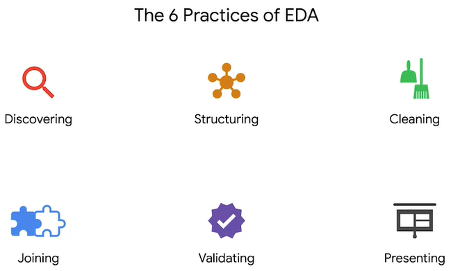
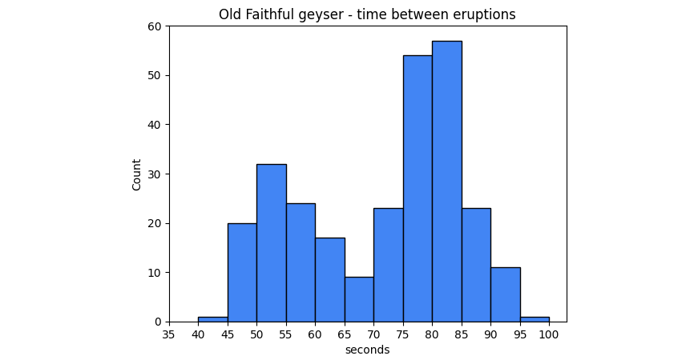
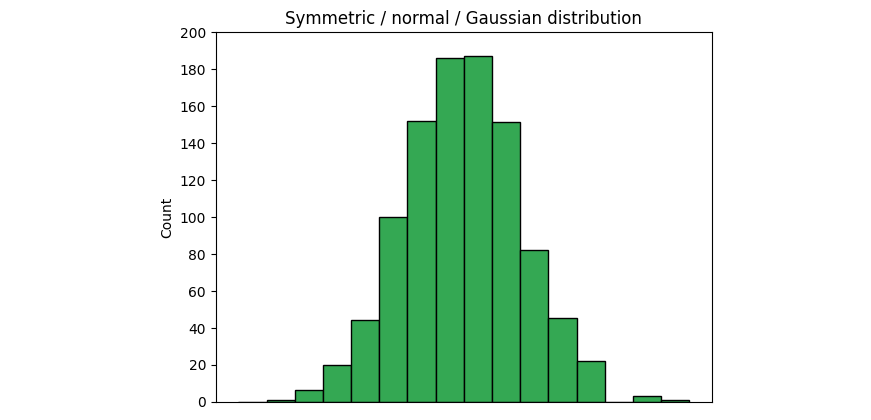

# Go Beyond the Numbers: Translate Data into Insights

### Data Analysis: A Journey of Discovery

#### Unearthing Insights from Data

- Just like archaeologists uncover hidden artifacts, data professionals extract valuable insights from data, revealing hidden trends and knowledge.
- This course aims to equip you with the skills to find and communicate these data stories effectively, whether you're an aspiring data professional or simply want to enhance your storytelling abilities.

#### Navigating the World of Data

- We'll explore a six-part process called **exploratory data analysis (EDA)** to uncover and shape data stories.
- The **PACE workflow (Plan, Analyze, Construct, Execute)** will guide our data exploration journey.

#### Essential Tools and Techniques

- **Data visualization** plays a crucial role in understanding and communicating data insights.
- We'll delve into:
  - Data sources, types, structuring, and cleaning.
  - Ethical considerations in handling raw data.
- **Python** will be our primary tool for performing EDA, building upon your existing Python skills.

### How can you apply the PACE workflow in a project? The PACE Workflow: Plan, Analyze, Construct, Execute

The PACE workflow provides a structured and efficient approach to data projects, ensuring clarity and focus throughout the process. Here's how to apply it:

#### 1. Plan

- **Define your goals**: Identify the key questions you want to answer and the insights you're aiming to uncover.
- **Gather your data**: Pinpoint the necessary data sources and collect the required information.
- **Prepare your data**: Clean and format your data to ensure it is accurate, consistent, and ready for analysis.

#### 2. Analyze

- **Explore your data**: Employ exploratory data analysis (EDA) techniques to uncover patterns, trends, and relationships within your data.
- **Draw insights**: Interpret the findings and highlight key takeaways that address your project objectives.

#### 3. Construct

- **Develop your narrative**: Build a compelling story around your insights, supported by data visualizations and clear explanations.
- **Choose your communication tools**: Decide on the best formats for presenting your findings, such as reports, presentations, or dashboards.

#### 4. Execute

- **Share your findings**: Present your insights to your audience in an engaging and understandable manner.
- **Gather feedback**: Be receptive to feedback and iterate on your work as needed based on the responses you receive.

#### A Cyclical Process

- The PACE workflow is iterative. As you progress, you may revisit earlier stages to refine your approach, incorporate new data, or enhance your analysis and communication.


## module 1
### Exploring the Six Practices of Exploratory Data Analysis (EDA)

#### Understanding EDA Practices

- **Comprehensive Framework**: Delve into the six essential practices of EDA, exploring their significance and how they drive effective data analysis.
- **Alignment with PACE**: Learn how these practices integrate seamlessly with the PACE workflow (Plan, Analyze, Construct, Execute), enhancing efficiency and outcomes.

#### The Power of Data Visualization

- **Key Role in EDA**: Discover how data visualization is a cornerstone of exploratory data analysis, enabling data professionals to extract meaningful insights.
- **Insight and Communication**: Understand how visualizations not only reveal patterns and trends but also serve as powerful tools for sharing findings with clarity and impact.

#### Why This Matters

- Data professionals rely on these practices to systematically approach raw datasets, uncover hidden insights, and translate them into actionable narratives.
- Mastering EDA and visualization techniques empowers you to derive value from data and effectively communicate your discoveries.

### Find Stories Using the Six Exploratory Data Analysis Practices

#### What is EDA?

- **Definition**: Exploratory Data Analysis (EDA) is a process that enables data professionals to understand, organize, and analyze datasets, uncovering patterns and insights.
- **Six Main Practices**:
  1. **Discovering**: Identifying key attributes and features in the data.
  2. **Structuring**: Organizing data into a usable format.
  3. **Cleaning**: Removing errors, inconsistencies, and irrelevant data.
  4. **Joining**: Merging datasets to create a comprehensive view.
  5. **Validating**: Ensuring data accuracy, consistency, and reliability.
  6. **Presenting**: Crafting insights into clear, ethical, and engaging narratives.

#### Why is EDA Important?

- **Data Storytelling**: Just as archaeologists piece together a narrative from scattered artifacts, EDA helps reveal meaningful stories and trends hidden within raw data.
- **Ethical and Accurate Representation**: EDA ensures insights are unbiased, truthful, and clearly communicated, maintaining data integrity and avoiding misrepresentation.
- **Decision-Making**: By uncovering valuable insights, EDA supports informed, data-driven decisions in various industries.

#### Key Takeaway

Mastering EDA practices equips data professionals with the skills to explore data methodically, ensuring their analysis is robust, ethical, and impactful.

#### Question 1: What might happen if bias is introduced during data structuring? => Understanding and Avoiding Bias in Data Structuring

##### Why is Bias in Data Structuring Important?

- **Impact on Conclusions**: Bias introduced during the data structuring process can lead to inaccurate or misleading results, which may affect decision-making and insights derived from the analysis.

##### Example of Bias in Data Structuring:

- **Scenario**: Suppose you are analyzing income levels and group people solely based on their hobbies without considering other critical factors like education or profession.
- **Outcome**: This approach might result in a biased and oversimplified view. For example, assuming that everyone who enjoys collecting stamps is wealthy ignores the influence of other important variables.

##### Key Takeaways:

1. **Multifactorial Consideration**: Always account for relevant factors to ensure a comprehensive and unbiased analysis.
2. **Avoid Generalizations**: Avoid drawing conclusions based on overly simplistic groupings or assumptions.
3. **Critical Thinking**: Regularly question your structuring methods and ensure they align with the data’s context and purpose.

By carefully addressing potential biases during the data structuring phase, you enhance the accuracy, reliability, and ethical quality of your data analysis.

#### Question 2: What would happen if you ignored the validating step in EDA? => The Importance of Validating Data in Exploratory Data Analysis (EDA)

##### Why Validation Matters:

Validation is a critical step in EDA that ensures your data is consistent, accurate, and reliable. Skipping this step can have significant consequences for your analysis and outcomes.

##### What Happens When Validation is Ignored?

1. **Working with Inaccurate Data**:
   - Errors, inconsistencies, or outliers may remain undetected.
   - These issues can distort your analysis and lead to incorrect conclusions.

2. **Making Poor Decisions**:
   - Flawed data leads to flawed insights, which can result in ineffective or even harmful decisions.

3. **Losing Credibility**:
   - Presenting unvalidated data can raise doubts about your professionalism and the accuracy of your work.

##### A Real-World Analogy:

Imagine finishing the cleanup and inventory of a warehouse but skipping the verification step. You might:
- Mislabeled items.
- Miss duplicates.
- Overlook valuable antiques.

The result? An inaccurate inventory that undermines trust and usability—just like unvalidated data can compromise your analysis.

##### Key Takeaway:

Validating your data ensures it’s:
- **Accurate**: Free from errors and inconsistencies.
- **Reliable**: Trustworthy for decision-making.
- **Consistent**: Uniform across all variables and records.

Validation is essential to building a strong foundation for your analysis and delivering credible, actionable insights.

#### Question 3: What Does Reliable Data Mean?

Reliable data refers to data that consistently provides accurate and dependable results when used for analysis, decision-making, or research. It is a critical aspect of data quality, ensuring that the insights derived are trustworthy and reproducible.

##### Characteristics of Reliable Data:

1. **Accuracy**:
   - The data reflects the real-world phenomena it represents without errors or inconsistencies.

2. **Consistency**:
   - The data remains uniform across different sources, timeframes, and analysis methods.
   - For example, the same data should yield the same results if analyzed repeatedly.

3. **Completeness**:
   - All required information is present, with no missing or incomplete records.

4. **Timeliness**:
   - The data is up-to-date and relevant for the time period of the analysis.

5. **Reproducibility**:
   - If other analysts use the same data and methodology, they should reach the same conclusions.

##### Why Reliable Data Matters:

- **Informed Decision-Making**:
  Reliable data ensures that decisions are based on factual and consistent information, reducing the risk of errors.
  
- **Credibility**:
  Analysis conducted with reliable data enhances your credibility as a data professional or researcher.
  
- **Efficiency**:
  Reliable data minimizes the need for extensive corrections or rework, saving time and resources.

##### Example:

Imagine you are analyzing sales data for a company. If the data is unreliable:
- Some transactions might be missing or recorded incorrectly.
- You might overestimate or underestimate sales figures.
- This could lead to flawed strategies, such as overstocking products or missing growth opportunities.

Reliable data ensures your analysis leads to accurate insights and effective decision-making. It is the cornerstone of any successful data-driven project.

### Question 4: How to Ensure Data Quality During the Validation Process?

To ensure data quality during the validation process, digital tools like R, JavaScript, or Python can be used to check for inconsistencies and errors in the dataset and its data types. 

Think of it as using a magnifying glass and a fine-tooth comb to carefully examine your data for any flaws! These tools can help you identify:

- **Misspellings and inconsistencies**: For example, ensuring all entries for "United States" are consistent and not misspelled as "US," "U.S.A," etc.
- **Inconsistent number or date formats**: Making sure dates are formatted consistently (e.g., MM/DD/YYYY or YYYY-MM-DD) and numbers use the same format.
- **Errors introduced during cleaning**: Double-checking that your cleaning process didn't accidentally delete or alter any data points incorrectly.

By thoroughly examining your data with these tools, you can ensure its accuracy and consistency, leading to more reliable insights.

## Deloitte Case Study: Using the PACE Framework for Data-Driven Solutions

### Overview

This case study highlights how Deloitte applied the PACE framework (Plan, Analyze, Construct, Execute) and the six practices of exploratory data analysis (EDA) — discovering, structuring, cleaning, joining, validating, and presenting — to help a billion-dollar cloud-based analytics company improve its marketing and performance data tracking.

### Client Challenges

Deloitte’s client faced several challenges related to marketing leads, campaign performance tracking, and data dashboarding:

1. **Difficulty Following Up on Marketing Leads**: The client struggled to track and follow up on thousands of marketing leads each month.
2. **Tracking Campaign Performance**: The existing system for performance tracking was inconsistent and relied heavily on manual data entry, making it inefficient.
3. **Personalized Data Dashboards**: The client lacked personalized dashboards that could display key performance metrics specific to different regions and departments.

### The PACE Framework

Deloitte’s approach to addressing these challenges followed the **PACE framework**, which consists of four phases: **Plan**, **Analyze**, **Construct**, and **Execute**.

---

#### **1. Plan**

In the planning phase, Deloitte focused on understanding the client’s goals and aligning the solutions with their business needs.

- **Stakeholder Engagement**: Meetings with key client stakeholders to understand their challenges, goals, and desired outcomes.
- **Defining Objectives and Key Results (OKRs)**: Defining clear OKRs such as:
  - Revenue from specific marketing campaigns.
  - Customer segmentation (industry, region, etc.).
  - Sales cycle time and campaign success rates.
  - Marketing cost per customer acquisition.
- **Data Requirements**: Understanding the data needed for better decision-making and the scope of data collection.
- **Milestone Establishment**: Key milestones included:
  - Aligning with the client on the future vision for data architecture.
  - Establishing new data infrastructure and tools.
  - Rolling out descriptive, diagnostic, and predictive analytics.
  - Training the global sales team.

---

#### **2. Analyze**

The analysis phase involved thoroughly understanding the client’s existing data and identifying gaps.

- **Data Discovery**: Deloitte explored the client’s data, which was inconsistent in naming conventions and structure, making it difficult to analyze.
- **Performance Tracking Review**: The existing performance tracking was inefficient and overly broad, with regional data kept separately, making consolidation difficult.
- **Data Structuring and Cleaning**: Deloitte standardized and cleaned the data, ensuring all variables were defined consistently across regions and departments.
- **Insights Exploration**: Deloitte explored what insights could be drawn from the structured data, focusing on sales cycles, regional differences, and campaign types.

---

#### **3. Construct**

During the construction phase, Deloitte focused on designing and building the solution.

- **Data Infrastructure Overhaul**: Deloitte redesigned the data architecture to streamline performance tracking and ensure consistency across regions.
- **Tailored Dashboards**: Deloitte built personalized dashboards for different stakeholder groups (e.g., senior executives, regional teams) to track OKRs and performance metrics.
- **Data Dictionary Creation**: A data dictionary was created to ensure all stakeholders understood the meaning and use of each data variable.
- **Predictive Analysis Tools**: Deloitte built predictive models to help the client set aggressive but achievable future targets based on historical data.

---

#### **4. Execute**

The execution phase focused on implementing the solution and ensuring that the client could effectively use the new tools.

- **Data Infrastructure Implementation**: The new data infrastructure was deployed globally, replacing the old, inconsistent system with a standardized one.
- **Personalized Dashboards Deployment**: The new dashboards were rolled out, enabling stakeholders to filter data by region, product, or campaign, and make data-driven decisions.
- **Training and Support**: Deloitte provided extensive training to the client’s teams, ensuring they could use the dashboards and maintain the new data infrastructure.
- **Ongoing Support and Feedback**: Deloitte continued to support the client post-implementation, making adjustments based on feedback and ensuring the system remained relevant.

---

#### **Results**

By following the PACE framework, Deloitte achieved several key outcomes:

- **Improved Data Consistency**: Sales data was properly linked to marketing campaigns, giving a clearer picture of campaign performance.
- **Actionable Insights**: The dynamic dashboards revealed previously hidden trends, such as the overemphasis on acquiring new clients at the expense of existing ones.
- **Enhanced Decision-Making**: Stakeholders were able to make more informed, data-driven decisions, improving alignment with company objectives.
- **Increased Efficiency**: The new system reduced manual work, allowing for real-time tracking and performance measurement.
- **Better Work-Life Balance for Analysts**: The automation of data collection and analysis allowed analysts to focus on interpreting data and providing valuable insights.

---

#### **Conclusion**

Deloitte’s use of the **PACE framework** and EDA practices helped their client transform its data management and analysis processes. By rebuilding the data infrastructure and creating dynamic dashboards, Deloitte enabled the client to uncover hidden insights and make more agile business decisions, ultimately improving revenue and operational efficiency. This case demonstrates the value of structured data practices in solving complex business problems and driving success.

### Benj as Product Analyst: Data science and storytelling
#### Exploratory Data Analysis (EDA)

Exploratory Data Analysis (EDA) is a critical step in understanding new datasets. It involves:
- **Understanding Data**: Analyzing the source, purpose, limitations, and potential biases of the data.
- **Data Insights**: Gaining insights into patterns, trends, and anomalies in the data to inform further analysis or decision-making.
  
EDA helps analysts clean, structure, and visualize data, making it easier to identify significant findings and inform subsequent actions.

#### Data Storytelling for Impact

Effective storytelling with data is essential for communicating insights clearly and driving action. Key elements include:
- **Categorizing Data**: Grouping data (e.g., by user types, devices, or use cases) helps craft compelling narratives that resonate with diverse audiences.
- **User Understanding**: Analyzing user demographics and behaviors provides valuable insights for product development and strategic decisions.

By framing data insights in a story format, analysts can ensure their findings are not just understood, but also actionable.

#### Ethics in Data Analysis

Ethical considerations are crucial in the field of data analysis to ensure fairness and privacy. Analysts should:
- **Minimize Bias**: Approach analyses with minimal preconceptions to avoid introducing bias into results.
- **Data Privacy**: Protecting data privacy and ensuring responsible de-identification practices are key to maintaining ethical standards in data analysis.

Responsible data analysis helps build trust and integrity in the insights derived from the data.

### Combining PACE and EDA Practices

Combining the PACE framework with Exploratory Data Analysis (EDA) can lead to more effective data analysis.

#### PACE and EDA

- **PACE Framework**: Stands for Plan, Analyze, Construct, and Execute, helping data professionals stay focused on project goals.
- **EDA Across PACE**:
  - EDA is not limited to the analysis phase; it can be applied to all stages of PACE.
  - For instance:
    - Discovering data patterns aligns with the **Planning** phase.
    - Presenting findings is crucial for the **Execution** phase.

#### Importance of Communication and Ethical Considerations

- **Clear Communication**:
  - Ensures stakeholders understand project goals, reducing wasted time and effort.
- **Ethical Responsibility**:
  - Data professionals must accurately represent data, even if it involves:
    - Pushing back against stakeholder pressure.
    - Addressing unrealistic timelines.

### The EDA Process

#### Characteristics of EDA

- **Iterative and Non-Sequential**:
  - The six practices of EDA are not performed in a fixed order.
  - Practices are repeated as needed based on the specific dataset.
- **Flexibility**:
  - The EDA process is tailored to each dataset.
  - Data professionals rely on logic and experience to determine the appropriate practices and their sequence.

#### EDA and Ethical Machine Learning

- **Human Augmentation**:
  - EDA promotes human oversight in AI and machine learning.
  - Data scientists can identify and mitigate bias, imbalance, and inaccuracies in data.
- **Bias Evaluation**:
  - Through methodical EDA, biases in data can be detected and addressed.
  - Ensures fairness and ethical considerations in machine learning models.

### Glossary Terms from Module 1

#### Terms and Definitions from Course 3, Module 1

- **Bias**:  
  Refers to organizing data results in groupings, categories, or variables that are misrepresentative of the whole dataset.

- **Cleaning**:  
  The process of removing errors that might distort your data or make it less useful; one of the six practices of EDA.

- **Data Visualization**:  
  A graph, chart, diagram, or dashboard created as a representation of information.

- **Discovering**:  
  The process data professionals use to familiarize themselves with the data so they can start conceptualizing how to use it; one of the six practices of EDA.

- **Exploratory Data Analysis (EDA)**:  
  The process of investigating, organizing, and analyzing datasets and summarizing their main characteristics, often by employing data wrangling and visualization methods.  
  The six main practices of EDA are: discovering, structuring, cleaning, joining, validating, and presenting.

- **Joining**:  
  The process of augmenting data by adding values from other datasets; one of the six practices of EDA.

- **PACE**:  
  A workflow data professionals can use to remain focused on the end goal of any given dataset; stands for Plan, Analyze, Construct, and Execute.

- **Presenting**:  
  The process of making a cleaned dataset available to others for analysis or further modeling; one of the six practices of EDA.

- **Structuring**:  
  The process of taking raw data and organizing or transforming it to be more easily visualized, explained, or modeled; one of the six practices of EDA.

- **Validating**:  
  The process of verifying that the data is consistent and high quality; one of the six practices of EDA.


## **Discovering** is the Beginning of an Investigating

### Import Datasets with Python

#### 1. Import Data from CSV File

- Using `open()`:
  ```python
  with open('example_filepath/file', mode='r') as file:
      data = file.read()
'r' read
'w' write
'a' append
'+' create new file

import pandas as pd
df = pd.read_csv('example_filepath/file')

#### 2. Importing Data from Databases

- Databases like BigQuery are valuable resources for storing and accessing large datasets.
You can directly query and retrieve data from BigQuery using SQL, either through their platform or your local environment.

### Pandas Methods for the Discovery of a Dataset

#### Understanding Your Dataset

- **`DataFrame.head()`**:  
  Displays the first few rows (default is 5) of your dataset, providing a glimpse of its structure and content.

- **`DataFrame.info()`**:  
  Provides a concise summary of your dataset, including:
  - Data types
  - Missing values
  - Memory usage

#### Descriptive Statistics

- **`DataFrame.describe()`**:  
  Generates descriptive statistics such as:
  - Mean
  - Minimum and maximum values
  - Quartiles  
  This helps you understand the distribution of your data.

- **`DataFrame.shape`**:  
  Returns the dimensions of your dataset as a tuple `(rows, columns)`. Note that this is an **attribute**, not a method, so it does not require parentheses.

- **`DataFrame.to_datetime`**:
  Convert the Date Joined column to datetime => companies["Date Joined"] = pd.to_datetime(companies["Date Joined"])

### Create Structure from Raw Data

Structuring involves organizing, gathering, separating, grouping, and filtering data to gain insights.  
It is a crucial step in data analysis that helps make raw data more manageable and insightful.

#### Methods of Structuring Data

- **Sorting**:  
  Arranging data in a meaningful order, such as ascending or descending, to better understand its distribution.

- **Extraction**:  
  Retrieving specific columns of data from a dataset for further analysis, comparisons, or visualization.

#### More Methods of Structuring Data

- **Filtering**:  
  Selecting a subset of data based on specific criteria to focus on relevant information.

- **Slicing**:  
  Extracting a smaller portion of data by selecting specific rows and/or columns for examination from different perspectives.

### Histograms

Histograms are essential for understanding the characteristics of a dataset, such as:  
- The shape of the distribution  
- Presence of outliers  
- The center and spread of the data  

- The following example is a histogram of the number of seconds between eruptions of the Old Faithful geyser in Yellowstone National Park, Wyoming, USA. 



#### Interpreting Histograms

- Interpreting histograms involves understanding the **shape**, **center**, and **spread** of the distribution.
- Common shapes of histograms include:
  - **Symmetric**: A symmetric histogram has a bell-shaped curve with a peak in the middle, indicating that the data is evenly distributed around the mean. This is also known as a normal, or Gaussian, distribution.
  
  
  - **Skewed**: A skewed histogram has a longer tail on one side than the other. A right-skewed histogram has a longer tail on the right side, indicating that there are more data points on the left side of the histogram. 
  
  A left-skewed distribution has a longer tail on the left side, indicating more data points on the right side.
  
  - **Bimodal**: A bimodal histogram has two distinct peaks, indicating that the data has two modes.
   
  
  - **Uniform** : A uniform histogram has a flat distribution, indicating that all data points are evenly distributed.
  Each shape provides insights into the data's distribution.
  

#### Creating Histograms

- Python libraries such as **seaborn** and **matplotlib** make it easy to create histograms.
- Commonly used functions include:
  - `plt.hist()` (from matplotlib) => plt.hist(x, bins=10, …)
  `
  # Plot histogram with matplotlib pyplot
  plt.hist(df['seconds'], bins=range(40, 101, 3))
  plt.xticks(range(35, 101, 3))
  plt.yticks(range(0, 61, 10))
  plt.xlabel('seconds')
  plt.ylabel('count')
  plt.title('Old Faithful geyser - time between eruptions')
  plt.show();
  `
  - `sns.histplot()` (from seaborn)  => sns.histplot(x, bins, binrange, binwidth …)
  `
  # Plot histogram with seaborn
  ax = sns.histplot(df['seconds'], binrange=(40, 100), binwidth=5, color='#4285F4', alpha=1)
  ax.set_xticks(range(35, 101, 5))
  ax.set_yticks(range(0, 61, 10))
  plt.title('Old Faithful geyser - time between eruptions')
  plt.show();
  `
- These functions offer flexibility in customizing the histogram's appearance, such as:
  - Defining bin sizes
  - Setting ranges

## Clean Your Data

### Missing Data and Its Implications

Missing data, represented as **N/A**, **NaN**, or blanks, poses a significant challenge in data analysis as it can lead to inaccurate conclusions if not addressed properly.  
The impact of missing data can range from negligible to substantial depending on the amount and nature of the missing values. It can hinder analysis and requires careful communication with stakeholders.

#### Methods for handling missing data

- **Requesting Data Owners**:  
  - Asking data owners to fill in missing values is the ideal solution, especially when dealing with large quantities of missing data.

- **Deleting Missing Data**:  
  - This approach may be appropriate if:
    - The percentage of missing values is low.
    - The deletion doesn't significantly bias the analysis.  
  - **Caution**: Deleting missing data can skew results if the missing values are not random.

#### Ethical Considerations

- Data professionals must consider the **ethical implications** of their chosen approach when addressing missing data.
- **Transparency**:  
  - It’s essential to be transparent with stakeholders about:
    - The approach used to handle missing data.
    - The potential impact of missing data on the analysis.
- **Thoughtful Consideration**:  
  - The quantity and importance of missing values should guide the strategy for handling them.

### Data deduplication with Python
- A simple way to identify duplicates is to use the  duplicated() function from Pandas. duplicated() is a method of the DataFrame class.  

`
print(df.duplicated()) # drop duplicates of exact matches of entire rows of data

df = df.drop_duplicates(subset='style') #

print(df.duplicated(subset=['type'], keep='last')) # duplicates in only one column (subset) of values and labeling the last duplicates as “false,” so that they are “kept”
`

### Outliers

Outliers are data points that are significantly different from other data points in a dataset.

#### Types of Outliers

- **Global Outliers**:  
  - Completely different from the rest of the data.  
  - May result from data entry errors or represent extreme, unusual values.  
  - Have no association with other outliers.

- **Contextual Outliers**:  
  - Appear as normal data points under certain conditions but become outliers under most other conditions.  
  - Example: A spike in movie sales a decade after a film's release would be considered a contextual outlier.

- **Collective Outliers**:  
  - A group of abnormal points that follow similar patterns and are isolated from the rest of the population.

#### Why Outliers are Important

- **Impact on Analysis**:  
  - Outliers can skew the results of your analysis and lead to inaccurate conclusions.
- **Role in EDA**:  
  - It's crucial to identify and address outliers during the exploratory data analysis (EDA) phase.

#### Dealing with Outliers

- **Identification**:  
  - Use data visualization techniques like:
    - Scatter plots
    - Box plots
    - Histograms  

- **Actions**:  
  - Decide to:
    - Remove outliers.
    - Replace them with other values.
    - Keep them in the dataset, depending on the context.

- **Ethical Considerations**:  
  - Carefully consider the ethical implications before removing or manipulating outliers.

Hanndle outlier using python: [Reference_guide_ How_to_handle_outliers](../images/Reference_guide_%20How_to_handle_outliers.pdf)

### Data transformation
#### Change Categorical Data to Numerical Data

##### What is Categorical Data?

- **Definition**:  
  Categorical data is qualitative data divided into a limited number of groups, often represented with words.  

- **Examples**:  
  - Demographics such as:
    - Occupation
    - Ethnicity
    - Educational attainment

##### Why Convert Categorical Data?

- **Model Compatibility**:  
  - Many data models and algorithms are designed for numerical data.  
  - These models may not work optimally with raw categorical data.

- **Facilitates Analysis**:  
  - Converting categorical data to numerical form enables:
    - Analysis
    - Prediction
    - Classification
    - Other data operations

### Encoding Categorical Data

#### Overview

Transforming categorical data into numerical format is crucial for analysis and machine learning models, as many algorithms require numerical input.  
Two common techniques are **Label Encoding** and **One-Hot Encoding**.

---

#### Encoding Techniques

1. **Label Encoding**:  
   - Assigns a unique numerical value to each category in the dataset.  
   - **Example**:  
     Suppose you have a dataset with a column `Fruit`:
     ```
     Fruit
     -----
     Apple
     Banana
     Cherry
     Apple
     Banana
     ```
     After label encoding:
     ```
     Fruit (Encoded)
     ---------------
     0
     1
     2
     0
     1
     ```
     Here, `Apple` = 0, `Banana` = 1, `Cherry` = 2.

   - **Use Case**:  
     Suitable when categories have a **natural order** (e.g., low, medium, high) or when using algorithms like **decision trees** or **random forests**, which handle numerical labels without assuming order.

---

2. **One-Hot Encoding**:  
   - Creates dummy variables (binary indicators) for each category.  
   - **Example**:  
     Using the same dataset with a column `Fruit`:
     ```
     Fruit
     -----
     Apple
     Banana
     Cherry
     Apple
     Banana
     ```
     After one-hot encoding:
     ```
     Apple  Banana  Cherry
     -----  ------  ------
     1      0       0
     0      1       0
     0      0       1
     1      0       0
     0      1       0
     ```

   - **Use Case**:  
     Ideal when categories do **not have a natural order** or when working with **dimensionality reduction** techniques like **PCA**.

---

#### Choosing the Right Encoding Method

- **Label Encoding**:
  - **Pros**: Efficient for datasets with many categories.  
  - **Cons**: May introduce unintended ordinal relationships between categories if not handled correctly.
  - **Example Use Case**: Encoding the `Education` column in a dataset where levels (High School < Bachelor's < Master's < Ph.D.) naturally follow an order.

- **One-Hot Encoding**:
  - **Pros**: Avoids introducing ordinal relationships, ensuring no implicit ranking of categories.
  - **Cons**: Can lead to **high dimensionality** for datasets with many unique categories.  
  - **Example Use Case**: Encoding the `City` column where cities like "New York," "London," and "Tokyo" have no inherent order.

---

#### Practical Implementation in Python

- **Label Encoding**:
  ```
  from sklearn.preprocessing import LabelEncoder

  # Example dataset
  fruits = ['Apple', 'Banana', 'Cherry', 'Apple', 'Banana']
  label_encoder = LabelEncoder()
  encoded_labels = label_encoder.fit_transform(fruits)
  print(encoded_labels)  # Output: [0, 1, 2, 0, 1]
from sklearn.preprocessing import OneHotEncoder
import numpy as np

# Example dataset
fruits = np.array(['Apple', 'Banana', 'Cherry', 'Apple', 'Banana']).reshape(-1, 1)
one_hot_encoder = OneHotEncoder(sparse=False)
one_hot_encoded = one_hot_encoder.fit_transform(fruits)
print(one_hot_encoded)
# Output:
# [[1. 0. 0.]
#  [0. 1. 0.]
#  [0. 0. 1.]
#  [1. 0. 0.]
#  [0. 1. 0.]]
```

- Review the reference guide for data cleaning in python: [Reference guide: Data cleaning in Python](../images/Reference_guide_%20Data_cleaning_in_Python.pdf)

### The Value of Input Validation

#### Data Validation: Why and What to Look For?

- **Why Validate Data?**  
  - Ensures **accuracy** in business decisions.  
  - Improves the performance of complex models.

- **Key Aspects to Check During Validation**:  
  - **Data Format Consistency**: Ensure all data entries follow the expected format.  
  - **Range Consistency**: Verify that values fall within acceptable ranges.  
  - **Data Type Consistency**: Confirm that all entries match the expected data types.

---

#### Joining in Exploratory Data Analysis (EDA)

- **What is Joining?**  
  - The process of augmenting data by adding values from other datasets.  
  - Similar to a chef enhancing a recipe by adding more ingredients.

- **Key Considerations When Joining Datasets**:  
  - Ensure **formatting** and **data entries** align.  
  - Verify that data types are consistent across datasets to maintain data integrity.

---

#### Summary

Validating input data and ensuring consistency during joining are foundational practices in **EDA**. They enhance data quality, leading to better insights and improved decision-making.

